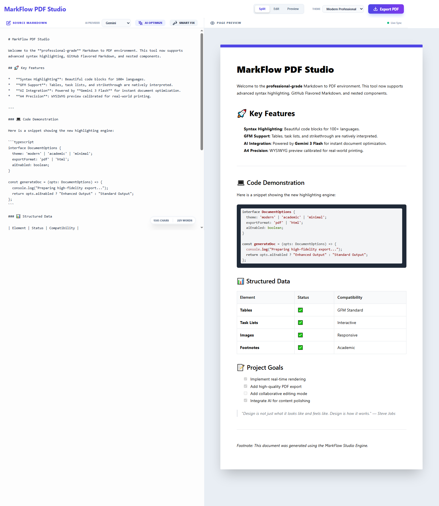

# MarkFlow PDF Studio

[](https://php.net)
[](https://opensource.org/licenses/MIT)

**MarkFlow PDF Studio** es un editor profesional de Markdown basado en web, diseñado para escritores, desarrolladores y académicos que necesitan un puente perfecto entre escribir en Markdown y producir documentos PDF de alta fidelidad. Cuenta con vista previa en tiempo real y lado a lado, múltiples temas de documentos y potentes capacidades integradas de edición por IA impulsadas tanto por Google Gemini como por OpenRouter.


*(Marcador de posición de captura de pantalla: Una vista previa de la interfaz de la aplicación)*

---

## ✨ Características principales

- **Vista previa en vivo de Markdown**: Un editor de pantalla dividida WYSIWYG (Lo que ves es lo que obtienes) que renderiza Markdown mientras escribes.
- **Múltiples modos de vista**: Cambie entre un editor/vista previa dividido, solo editor o solo vista previa según su flujo de trabajo.
- **Estilo temático**: Elija entre temas profesionales como `Moderno`, `Académico` o `Minimalista` para formatear instantáneamente su documento.
- **Resaltado de sintaxis**: Los bloques de código se resaltan automáticamente para más de 100 lenguajes, preservando la legibilidad y estética.
- **Edición impulsada por IA**:
  - **Elección de proveedor**: Cambie sin problemas entre Google Gemini y OpenRouter.
  - **Corrección inteligente**: Corrija automáticamente ortografía, gramática y puntuación.
  - **Optimización por IA**: Mejore el estilo de escritura para mayor concisión y profesionalismo.
- **Exportación de PDF de alta fidelidad**: Genere documentos A4 listos para imprimir directamente desde el panel de vista previa con un solo clic.
- **Sin dependencias**: Funciona con una configuración estándar de servidor PHP/web. Todas las bibliotecas front-end se cargan a través de CDN.

## 🛠️ Pila tecnológica

- **Backend**: PHP 8.0+ (para manejo de API)
- **Frontend**: JavaScript vanilla (ES6+), HTML5, CSS3
- **Estilo**: Tailwind CSS (vía CDN)
- **Análisis de Markdown**: `marked.js`
- **Resaltado de sintaxis**: `highlight.js`
- **Generación de PDF**: `html2pdf.js`

## 🚀 Empezando

Siga estas instrucciones para obtener una copia del proyecto funcionando en su máquina local.

### Requisitos previos

- Un servidor web con PHP 8.0 o superior (por ejemplo, Apache, Nginx, o un servidor de desarrollo local como Laragon, XAMPP).
- Extensión cURL para PHP habilitada (para hacer solicitudes API).

### Instalación y configuración

1.  **Clonar o descargar el código**
    - Coloque el contenido de este directorio (`mfs`) en una carpeta servida por su servidor web (por ejemplo, `htdocs`, `www`).

2.  **Configurar variables de entorno**
    - En la raíz de este directorio, encontrará un archivo llamado `.env.example`.
    - Cree una copia de este archivo y renómbrela a `.env`.
    ```bash
    cp .env.example .env
    ```
    - Abra el nuevo archivo `.env` y complete sus claves API.

3.  **Configurar claves API**
    - **`GEMINI_API_KEY`**:
      1. Vaya a [Google AI Studio](https://aistudio.google.com/app/apikey).
      2. Haga clic en "Create API key" y copie la clave generada.
    - **`OPENROUTER_API_KEY`**:
      1. Vaya a [OpenRouter.ai](https://openrouter.ai/keys).
      2. Inicie sesión y haga clic en "Create a Key".
      3. Copie la clave generada.

    > **IMPORTANTE**: Su servidor web debe estar configurado para cargar estas variables desde el archivo `.env`. Los servidores PHP comunes no hacen esto por defecto. Es posible que deba:
    > - Agregar un pequeño script PHP para cargar el archivo `.env` (por ejemplo, usando `symfony/dotenv`).
    > - O, establecer estas como variables de entorno reales en la configuración de su servidor (por ejemplo, en su archivo `.htaccess` de Apache o `fastcgi_param` de Nginx).

## Uso

1.  Navegue a la URL del proyecto en su navegador web.
2.  Escriba o pegue su contenido Markdown en el panel del editor a la izquierda.
3.  Use los controles en el encabezado para cambiar el modo de vista y el tema.
4.  Para usar las funciones de IA:
    - Seleccione su **Proveedor de IA** deseado (Gemini u OpenRouter).
    - Haga clic en **AI OPTIMIZE** o **SMART FIX**.
5.  Haga clic en **Export PDF** para descargar un PDF de alta calidad de su documento.

## 🛣️ Hoja de ruta futura

- [ ] Agregar un selector de modelo para OpenRouter.
- [ ] Implementar indicaciones configurables por el usuario para acciones de IA.
- [ ] Agregar más temas y opciones de personalización.
- [ ] Explorar un modo de edición colaborativa.

## 📄 Licencia

Este proyecto está licenciado bajo la Licencia MIT - consulte el archivo [LICENSE.md](LICENSE.md) para obtener más detalles.
